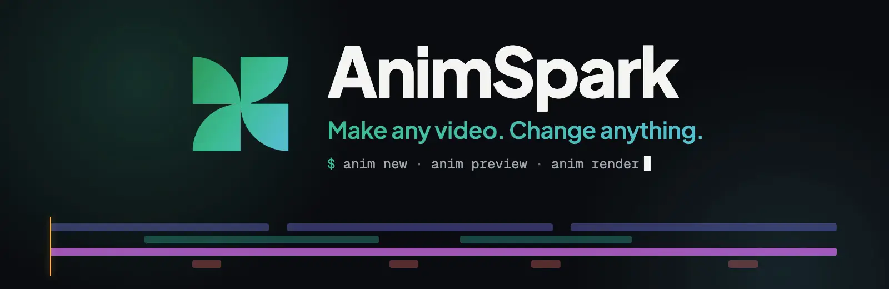
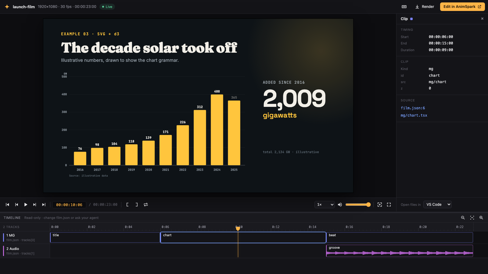

<p align="center">
  <a href="https://animspark.com"></a>
</p>

<p align="center">
  <a href="https://github.com/animspark/animspark/actions/workflows/ci.yml"></a>
  <a href="LICENSE"></a>
  
  <a href="docs/agents.md"></a>
</p>

<p align="center">
  <b>The open-source video agent.</b> A film format, a frame-exact renderer, a music engine and the<br>
  skills that let Claude Code, Codex or Cursor make motion graphics, product videos and explainers — on your machine.
</p>

<p align="center">
  <a href="#quick-start">Quick start</a> ·
  <a href="#how-a-film-is-made">How it works</a> ·
  <a href="examples">Examples</a> ·
  <a href="docs/agents.md">Use with your agent</a> ·
  <a href="docs/cloud.md">Voice &amp; media</a> ·
  <a href="https://animspark.com">AnimSpark app</a>
</p>

<p align="center"><sub>The banner above is a film made with this engine — <a href="examples/brand-card">examples/brand-card</a>.</sub></p>

---

A film here is a folder of plain files: `film.json` places clips on tracks, and each motion-graphics
scene is a React component animated with GSAP. Because it is code, a coding agent can write it,
read its own errors, look at the frames it made and fix them — and you can review the diff.

```
my-film/code/
├── film.json          the running order: tracks of mg / video / audio clips
├── mg/intro.tsx       a scene — React + GSAP, every frame a pure function of time
├── assets/            footage, images, audio, fonts (yours, or fetched with `anim` commands)
├── skills/            the manuals your agent reads before it writes
└── AGENTS.md          the editor's manual (CLAUDE.md is the same file)
```

The engine owns the clock. Scenes never run their own timers, so every frame is reproducible:
what you see in the preview is exactly what `anim render` writes to the mp4.

## Quick start

Requirements: **Node.js 22+** and **ffmpeg** on your `PATH`. The first `anim check`, `look` or
`render` downloads the headless Chromium every frame is drawn with (via Playwright, about 100 MB,
once).

```bash
npm install -g animspark
anim new "a 20-second launch video for a note-taking app" --sec 20 --dir notes-launch
cd notes-launch/code
```

Open the folder in your agent and ask for the film. It reads `AGENTS.md` and the skills, writes
`film.json` and `mg/*.tsx`, and checks its own work with `anim check` and `anim look`.

While it works, watch the film take shape:

```bash
anim preview
```

<p align="center"></p>

`anim preview` is a timeline player that follows every save: the picture refreshes in place, the
timeline re-evaluates, and compile or runtime errors appear with links to the exact line in your
editor. It is read-only on purpose — the source is the single place a film changes.

When it's right:

```bash
anim render              # → .anim-out/film.mp4
```

## Commands

| Command | What it does |
| --- | --- |
| `anim new "<brief>" [--sec 30] [--aspect 16:9]` | Create a workspace with the manual and skills installed |
| `anim check [--timeline]` | Validate `film.json` and compile every scene the way the player will |
| `anim look [--from s --to s] [--fps n]` | Contact sheet of frames — how the agent sees pacing |
| `anim look --at <s>` | One full-resolution frame |
| `anim look --sound` | Draw the mix: loudness, which sound sits where |
| `anim preview [--port n]` | Live timeline player in the browser |
| `anim render [--fps n] [--width px]` | Burn the mp4 (and poster, and audio) into `.anim-out/` |
| `anim clip <id> [--format webm\|prores\|png]` | Export one clip, with transparency |
| `anim mcp` | Run as a local MCP server for agents that prefer tools |
| `anim login` | Connect AnimSpark Cloud for voice, sound effects, images and fonts |

Every command takes `--help`.

## How a film is made

`film.json` is the edit. Clips have a start (`at`), an optional source window (`time`) and a
`transform`; tracks stack top to bottom.

```json
{
  "stage": { "w": 1920, "h": 1080 },
  "tracks": [
    { "kind": "mg", "clips": [
      { "id": "intro", "src": "mg/intro", "at": 0 },
      { "id": "card",  "src": "mg/card",  "at": 4.2 }
    ] },
    { "kind": "audio", "clips": [
      { "id": "bed", "src": "assets/audio/music/bed.ts", "at": 0, "volume": 0.4 }
    ] }
  ]
}
```

A scene is a component. Animate with `useGSAP`; the host drives the timeline, so seeking to any
frame gives the same picture.

```tsx
import { useRef } from 'react';
import { gsap } from 'gsap';
import { useGSAP } from '@gsap/react';

export const durationSec = 4;

export default function Intro() {
  const root = useRef<HTMLDivElement>(null);
  useGSAP(() => {
    gsap.from('.word', { yPercent: 120, stagger: 0.08, duration: 0.9, ease: 'expo.out' });
  }, { scope: root });
  return (
    <div ref={root} style={{ position: 'absolute', inset: 0, display: 'grid', placeItems: 'center', background: '#0b0b10' }}>
      <h1 style={{ fontFamily: 'Inter', fontSize: 140, color: '#fff', overflow: 'hidden' }}>
        {'Write films in code'.split(' ').map((w) => <span key={w} className="word" style={{ display: 'inline-block', marginRight: 32 }}>{w}</span>)}
      </h1>
    </div>
  );
}
```

**Music is code too.** `assets/audio/music/bed.ts` above is a [muspark](packages/muspark) score —
chords, arpeggios, drums, a General MIDI soundfont — rendered to audio on your machine. No
account, no samples to license.

**Fonts** from a library of 200+ open-licensed families (Latin, Chinese, Japanese, Korean) load by
name — write `fontFamily: 'Playfair Display'` and the preview and render both fetch it.

**Scene libraries** ship in the box: formulas, code and scientific plots (`@animspark/stem`), score
views (`@muspark/ui`), plus three.js, p5, d3, world-atlas and the rest of the allow-listed npm
packages — charts and maps are drawn straight with d3, and the skills show how.

## Voice, sound effects and images

Everything above runs offline. Some things can't be written as code: narration, sound effects,
transcription, stock images. Those are `anim` commands backed by
[AnimSpark Cloud](https://animspark.com) — run `anim login` once with an API key — or by
your own provider keys through an open provider interface. See [docs/cloud.md](docs/cloud.md).

```bash
anim audio voice --language en --prompt "warm, confident narrator"   # pick a voice
anim audio tts --voice <voiceId> --text "Meet Notes. The fastest way to think."
anim audio sfx --prompt "soft UI click" --sec 1
```

## Use with your agent

`anim new` writes `AGENTS.md` and `CLAUDE.md`, so Claude Code, Codex and Cursor pick up the manual on
their own. Prefer tools? `anim mcp` exposes `check`, `look`, `render` and the media commands over
MCP. Setup snippets for each agent are in [docs/agents.md](docs/agents.md).

## What's in this repository

| Package | |
| --- | --- |
| [`packages/engine`](packages/engine) | The `anim` CLI: check, look, render, clip, preview, MCP, cloud providers |
| [`packages/film-build`](packages/film-build) | Evaluates and compiles films; mixdown |
| [`packages/film-runtime`](packages/film-runtime) | The runtime scenes run in: clock, `useGSAP` bridge, `useStage`, `useLocal` |
| [`packages/core`](packages/core) | The film contract: `film.json` schema, audio manifests, shared types |
| [`packages/player`](packages/player) | Play a film in any React app: host iframe, audio clock, transport |
| [`packages/muspark`](packages/muspark) · [`muspark-ui`](packages/muspark-ui) | Music as code: scores, synthesis, soundfont rendering |
| [`packages/scene-engine`](packages/scene-engine) | Shared scene primitives |
| [`scene-packages/*`](scene-packages) | Scene libraries: stem (formulas, code, plots), three, p5 |
| [`packages/engine/prompts/skills`](packages/engine/prompts/skills) | The skills: motion graphics and video editing, plus formula, sciplot, code-explainer and map |
| [`examples/`](examples) | Complete films you can open, preview and render |

## Open source and the AnimSpark app

This repository is the engine and the language: everything needed to write, preview and render a
film locally. [AnimSpark](https://animspark.com) is the product built on it — a desktop and web app
with a visual timeline editor, direct manipulation on the canvas, an AI director that plans and
writes the film for you, a media library, and cloud rendering. Films are the same files in both:
start here, open them there, or the other way round.

## Contributing

Issues and pull requests are welcome — see [CONTRIBUTING.md](CONTRIBUTING.md). To run from source:

```bash
pnpm install
pnpm anim new "test" --dir /tmp/anim-test --sec 4
```

## License

[Apache-2.0](LICENSE). Scenes animate with [GSAP](https://gsap.com), which is free to use under its own
[Standard License](https://gsap.com/standard-license) rather than Apache — see [NOTICE](NOTICE) for
GSAP, fonts and the soundfont.
