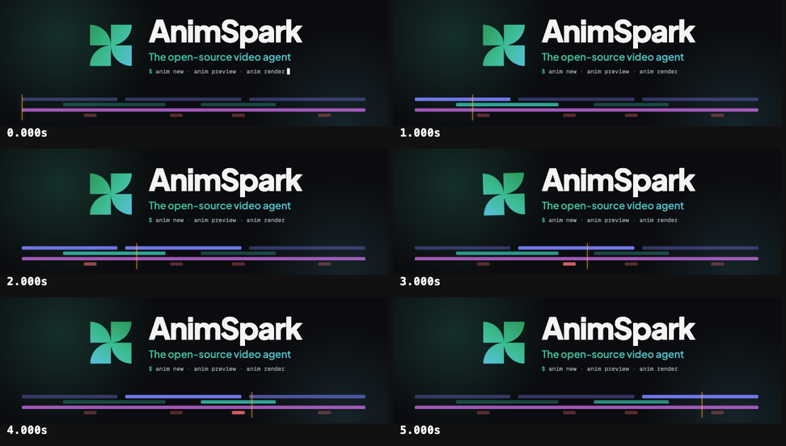

# Brand card



The banner at the top of this repository's README, made with this engine
([`mg/brand.tsx`](mg/brand.tsx)). One scene, two stages: `film.json` here is 1600×520 (the
README banner); on a 1280×640 stage the same scene lays itself out as the social preview.

It is a **seamless 6-second loop** — frame 0 and frame 6 are identical:

- the pinwheel mark has four-fold symmetry, so a 90° turn lands exactly where it started;
- the playhead sweeps the timeline once and wraps; clips light as it passes, and the full-length
  music bed stays lit, so nothing jumps at the seam;
- the caret blinks six times per loop.

Fonts are Plus Jakarta Sans and Geist Mono from the font library, loaded by family name.

```bash
anim render --fps 30        # → .anim-out/film.mp4
```

The README's animated WebP was made from that mp4 (ffmpeg → GIF palette → WebP).
