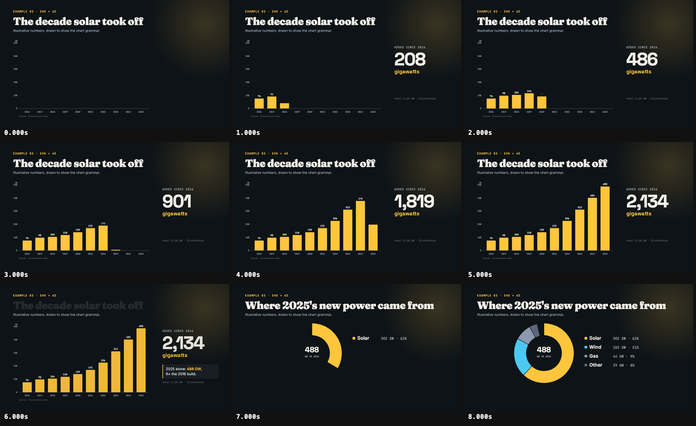

# Data chart

A 9-second data story drawn with plain SVG and d3 ([`mg/chart.tsx`](mg/chart.tsx)) — no chart
library: `d3-scale` for the axes, `d3-shape` for the donut, GSAP for time.

- A bar chart builds one year at a time while the headline counter adds up exactly what is on
  screen: bar heights, value labels and the counter are all computed from one number
  (`bars.p`, 0 → 1) tweened on the film clock, so they cannot drift apart.
- A callout lands on the record year, then the bars hand over to a donut whose slices sweep in
  order, each over its own share of `donut.p`.
- Frame 0 is already a complete picture (title and axes), as the mg manual asks.

The numbers are **illustrative** and labelled as such in the picture (subtitle and source line).
Swap in a real dataset by replacing `ADDED` and `MIX` and updating the source.

The film is silent on purpose (`anim check` notes it).
