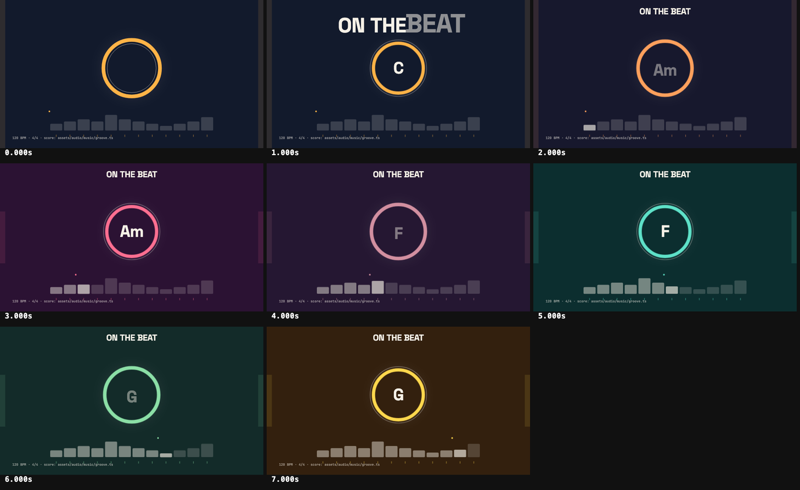

# On the beat

An 8-second piece where the picture is cued by the music.

- [`assets/audio/music/groove.ts`](assets/audio/music/groove.ts) is the score: 16 beats at
  120 bpm, written as data with `@muspark/core` (synth pad, synth bass, a plucked lead,
  kick / snare / hats). It uses only built-in synth voices, so nothing is downloaded.
- [`film.json`](film.json) puts that file on the film's audio track; the engine renders it
  to a WAV (cached next to it) for preview, look and render.
- [`mg/beat.tsx`](mg/beat.tsx) imports the same events and turns each into a cue with
  `cue({ score, time: [0, 8] }, event).start`:

| Event | Picture |
| --- | --- |
| kick (every beat) | the ring punches, a ripple leaves it |
| snare (backbeat) | the side bars flash |
| hat (off-beats) | the tick under it lights |
| lead note | its key in the roll lights for the note's length; key height is pitch |
| chord (every bar) | the colour field, ring colour and chord name change |

Motion leads the sound by 30 ms, which the eye reads as together. Change the score and
`anim check` re-renders the audio; the motion follows because it reads the same data.
`anim look --sound` draws the mix.
