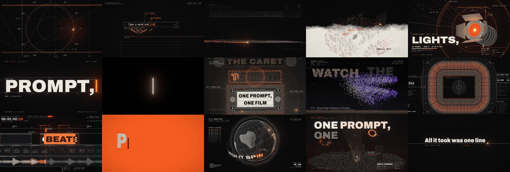

# One Prompt: the AnimSpark launch music video



A 91-second lyric music video where every frame is code: typography, 3D, light, particles and the cut on the
beat, rendered in real time in the browser. It is the launch film for [AnimSpark](https://animspark.com/?utm_source=github&utm_medium=example&utm_campaign=one-prompt-mv).
Watch it on [animspark.com](https://animspark.com/?utm_source=github&utm_medium=example&utm_campaign=one-prompt-mv) or [YouTube](https://youtu.be/Pd1H8iE3BHw).

## Run it

You need **Node.js 22+**, **ffmpeg** on your `PATH` and a WebGL2 browser (any current Chrome, Edge, Safari or
Firefox).

```sh
git clone https://github.com/animspark/animspark.git
cd animspark/examples/one-prompt-mv
npx animspark preview         # plays the film live in your browser
```

`preview` opens a local player (viewer, transport, timeline) and plays in real time. Keep it running while you
edit: change a shot in `mg/plates/` and save, and the picture updates on the spot. Errors show on the page.

With `npm install -g animspark` you get the `anim` command for the rest:

```sh
anim check                    # validate film.json and compile the plates
anim look --at 33             # one full-quality frame → .anim-look/
anim render                   # the mp4 → .anim-out/film.mp4
```

`anim preview` draws one sample per frame, so it plays in real time. `anim render` adds adaptive sub-frame motion
blur (`assets/data/render.json`), which is what the published video uses; a full 1080p60 render takes a few hours on
a laptop GPU.

## How it is built

| Path | What it is |
| --- | --- |
| `film.json` | Two tracks: the whole picture as one motion-graphics clip, and the song |
| `mg/px-film.tsx` | The host: hands the film clock to the engine and draws its canvas |
| `mg/px/` | The engine, adapted from [pdoom-video](https://github.com/mexicat/pdoom-video) (MIT). See [mg/px/README.md](mg/px/README.md) |
| `mg/plates/timeline.ts` | The edit: which plate is on screen when, cut on the lyric's beats |
| `mg/plates/handoff.ts` | What must be on screen, and where, at each cut, so the film plays as one take |
| `mg/plates/*.ts` | Nineteen shots in eighteen plates (the chorus plate plays twice), one idiom each: a construction drawing, the prompt, a ridgeline plot of the song, a model city, a lighting plot, a zoetrope, a projector beam, a marquee, a painted sky, a mixing desk, a stadium plan, an edit timeline, a globe at night, the premiere |
| `mg/lyrics.ts` | Every sung word with its start and end, which the plates key on |
| `assets/data/audio.json` | Beats, downbeats, kick / snare / hat onsets and band envelopes of the song |

The film was written with Claude Code over many rounds of direction: plate by plate, checked frame by frame with
`anim look`, and cut against the song. It is not a one-prompt generation; it shows how far code-first video can go.

## Make your own

Describe a film in one sentence and [AnimSpark](https://animspark.com/?utm_source=github&utm_medium=example&utm_campaign=one-prompt-mv)
writes it, animates it, adds voice, music and the edit, then hands you the timeline. Or open this folder in your
coding agent and ask it to change a plate.

## Credits and licences

- `mg/px/` is derived from [pdoom-video](https://github.com/mexicat/pdoom-video) © 2026 Giacomo Magnanini, MIT
  ([LICENSE-pdoom-video.txt](mg/px/LICENSE-pdoom-video.txt)).
- Fonts in `assets/fonts/`: Archivo, Anton, Instrument Serif, Monoton, IBM Plex Mono, Unbounded and Cormorant
  Garamond are under the SIL Open Font License ([OFL.txt](assets/fonts/OFL.txt)); the EMS stroke fonts are OFL and
  the Hershey fonts are public domain.
- The song, `assets/audio/music/one-prompt.mp3`, was made for this film by AnimSpark (generated with ElevenLabs
  Music). It is included so the example plays; it is not covered by this repository's Apache-2.0 licence and may
  not be reused in other works.
- Everything else here is Apache-2.0, like the rest of the repository.
