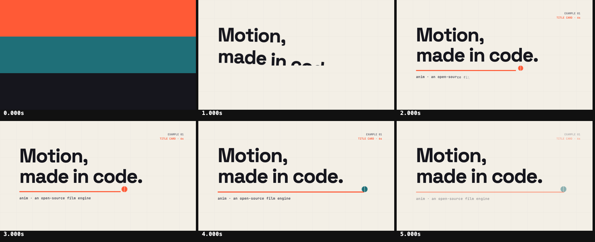

# Title card

A 6-second kinetic title card on a single MG scene ([`mg/title.tsx`](mg/title.tsx)).

- Three colour bands wipe across and leave the paper behind.
- Each line of the headline sits in an `overflow: hidden` mask; its letters rise out of it
  with a small rotation and a stagger.
- The rule draws, a dot rolls along it and changes colour, and a slow push keeps the held
  frame alive.
- Letters drop back into their masks and an ink panel closes on the wordmark.

Everything is one GSAP timeline created in `useGSAP`; the film clock seeks it, so preview,
`look` and `render` show the same frame at the same time. Sizes come from `useStage()`, so
the card works at any stage size. Fonts are the vendored Space Grotesk and JetBrains Mono.

The film is silent on purpose (`anim check` notes it).
